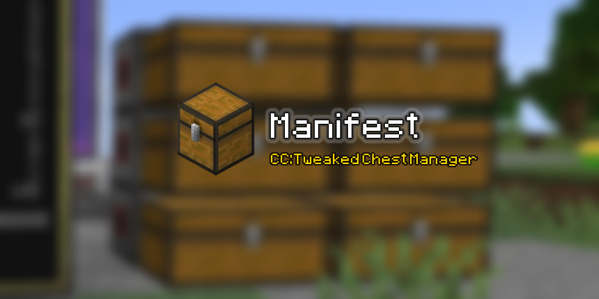

<p align="center">
  
</p>

<p align="center">
  
  
  
</p>

# Manifest

Manifest is a CC:Tweaked program that keeps a live index of every chest on a wired modem
network and lets you search it and pull items from a touch monitor

## Usage

```
wget run https://raw.githubusercontent.com/tomTTFB/manifest/master/server/install.lua

config    # pick the inventory items get sent to
reboot    # Manifest is startup.lua, so it runs on boot
```

Everything after that happens on the monitor. `config` can be re-run at any time from the
computer's terminal when the storage setup changes, and the same picker lives in the
Settings tab.

## Tabs

| Tab | What it covers |
| --- | --- |
| `Manifest` | Search, the item list, and the request bar lets you pick an item, set an amount, pull it |
| `Spatial` | AE2 spatial IO — load and unload cells, format a spare one, choose what pulses the port |
| `Settings` | Output inventory, text scale, scan interval, and where the web bridge lives |

## What is scanned

Every inventory peripheral (chests, barrels, etc.) on the network except the output and AE2 Spatial Cell Barrel. If the output is on the wired network then inventories attached directly
to the computer are skipped too, since they could never push to it.

All the chests are listed at once, so a scan costs about as long as the slowest single chest
rather than the sum of them. Display names are worked out from the item id `getItemDetail`
is far too slow to call on every scan, so search matches both, and typing `minecraft:` or a
mod prefix narrows the list to one mod's items.

Requests pull from one chest at a time until the amount is filled. Anything that comes up
short keeps its remainder on the queue rather than disappearing, so pressing pull again picks
up where it left off.

## Spatial IO

The Spatial tab controls an AE2 spatial IO port over the same network. Point it at the barrel
where the cells live and each one gets a load or unload button. one click moves the cell into
the port, pulses it, and puts the cell back in the slot it came from. Unformatted cells can
be formatted from storage, which captures whatever the pylons enclose.

The pulse comes from the computer's own redstone or from a networked redstone relay. A relay
is set high on every side, so only the computer's own output needs a side picking.

## Web bridge

`server/server.py` serves the working copy's Lua files to the computer so local edits can be
tested without going through GitHub, and bakes its own address into the installer on the way
out so the computer comes back to the same machine for the rest. `server/bridge.py`
runs beside it on port 8081, holds the state the computer posts each tick, and serves a page
that mirrors the monitor over SSE. Both need Flask and nothing else.

```
python server/server.py    # installer and Lua files, port 8080
python server/bridge.py    # state and web page, port 8081
```

The item list is nearly all of the payload and nearly always unchanged, so it only rides along
when it differs. Requests typed into the page come back as the reply to a tick and dispense on
the spot, since there is nobody stood at the monitor to press pull.

The bridge is optional. Manifest asks for its address on the first boot and writes the answer
to `manifest.cfg`, so it never asks twice, blanking the `bridge=` line by hand is how you get
asked again, and skipping it turns the whole thing off.

## Configuration

`manifest.cfg` sits next to the program and holds the output inventory, the cell barrel, the
redstone target, the bridge address, text scale, scan interval and which cells are marked as
loaded. It is written by the program and by `config`


## Disclaimer

This has only been run against one world on one pack. Nothing it does is destructive, but it
does move items around on your behalf, so point it at a storage system you are willing to
watch for a bit before trusting it with a wall of chests.

## License

MIT
